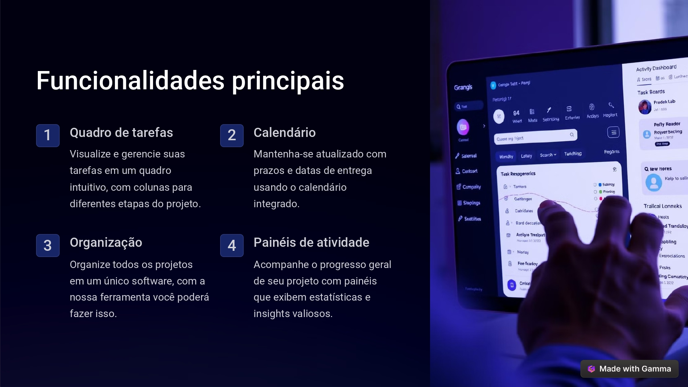
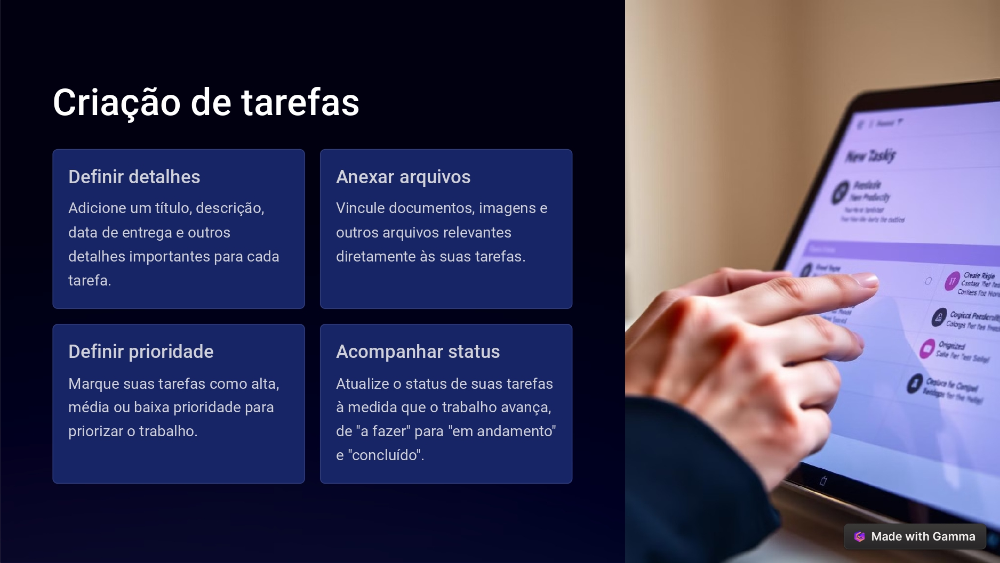
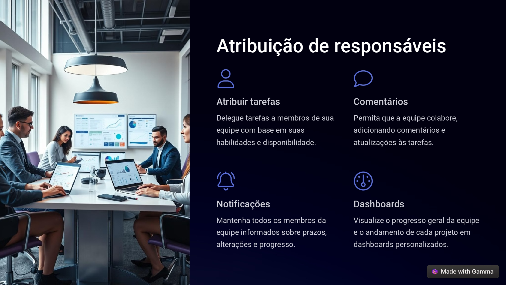
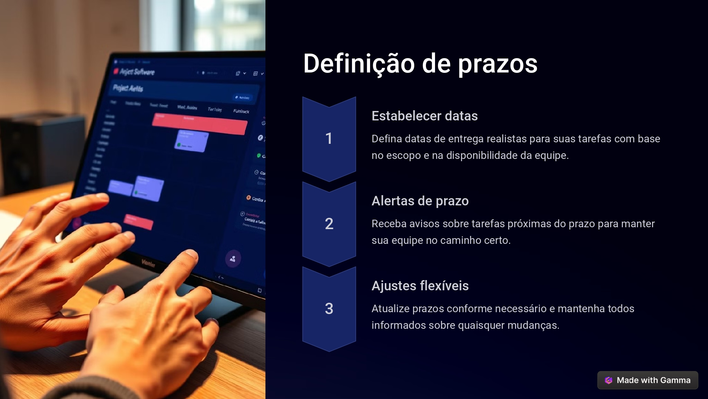
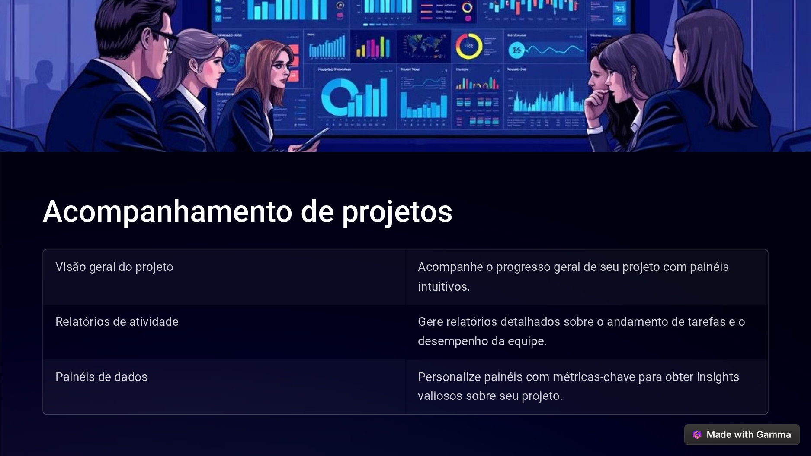
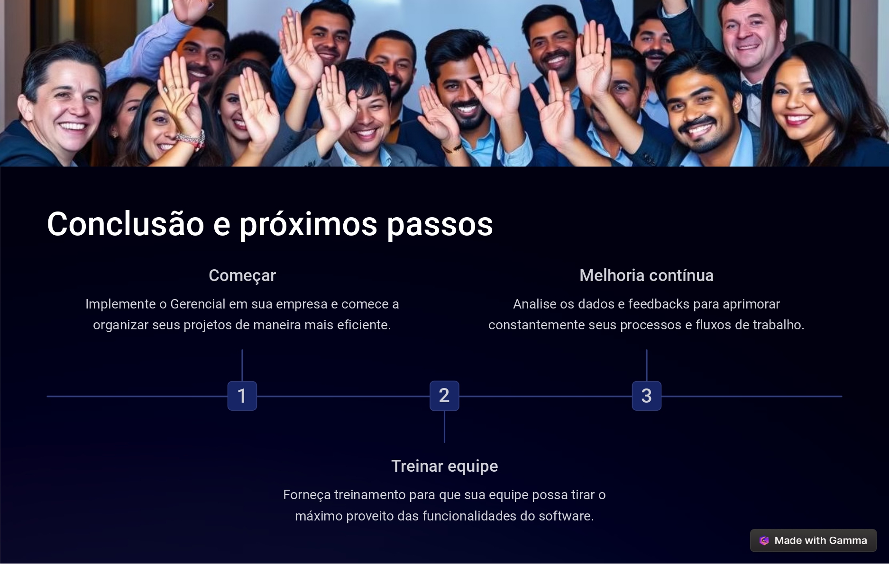

# gerencial-main

O Gerencial é uma ferramenta que proporciona um quadro visual para a organização de tarefas, utilizando recursos de arrastar e soltar. Ele facilita a colaboração ao permitir que a equipe atribua tarefas, adicione comentários e atualize o status dos projetos. Além disso, oferece funcionalidades para rastreamento do progresso dos projetos por meio de relatórios detalhados e visualizações claras das atividades em andamento.

O software oferece um quadro de tarefas intuitivo, que permite visualizar e gerenciar atividades por meio de colunas organizadas para diferentes etapas do projeto. Inclui um calendário integrado para monitorar prazos e datas de entrega, além de centralizar todos os projetos em uma única plataforma. Para acompanhar o progresso, o software dispõe de painéis de atividade que fornecem estatísticas e insights valiosos sobre o andamento geral do projeto.

Ao criar tarefas, você pode definir detalhes importantes, como título, descrição e data de entrega, e adicionar arquivos relevantes, como documentos e imagens, diretamente às tarefas. É possível também definir a prioridade das tarefas como alta, média ou baixa, para organizar melhor seu trabalho. Além disso, você pode acompanhar o progresso das tarefas atualizando seu status conforme o trabalho avança, mudando de "a fazer" para "em andamento" e, finalmente, para "concluído".

Você pode atribuir tarefas a membros da equipe conforme suas habilidades e disponibilidade, permitindo que eles colaborem adicionando comentários e atualizações. Notificações garantem que todos sejam informados sobre prazos, alterações e progresso. Além disso, dashboards personalizados oferecem uma visão clara do progresso geral da equipe e do andamento dos projetos.

Defina datas de entrega realistas para suas tarefas de acordo com o escopo e a disponibilidade da equipe, e receba alertas sobre prazos próximos para garantir que sua equipe permaneça no caminho certo. Além disso, você pode ajustar os prazos conforme necessário e manter todos informados sobre quaisquer mudanças.

Para acompanhar o progresso de seus projetos, utilize painéis intuitivos que oferecem uma visão geral do andamento geral. Gere relatórios detalhados para monitorar o progresso das tarefas e o desempenho da equipe, e personalize painéis com métricas-chave para obter insights valiosos sobre o projeto.

Para otimizar a gestão de projetos, comece implementando o Gerencial em sua empresa para organizar projetos de maneira mais eficiente. Em seguida, ofereça treinamento à sua equipe para garantir que todos possam utilizar as funcionalidades do software ao máximo. Por fim, analise dados e feedbacks regularmente para aprimorar continuamente seus processos e fluxos de trabalho.

Obrigado por acompanhar nosso projeto, siga nas redes sociais.

<a href="https://www.instagram.com/manoloadsc/" target="_blank">Emanuel</a>

<https://www.instagram.com/manoloadsc/>

<https://www.instagram.com/arthur.g.sil/>

<https://www.instagram.com/mateus_cris.tiano/>

<https://www.instagram.com/maicondametto/>