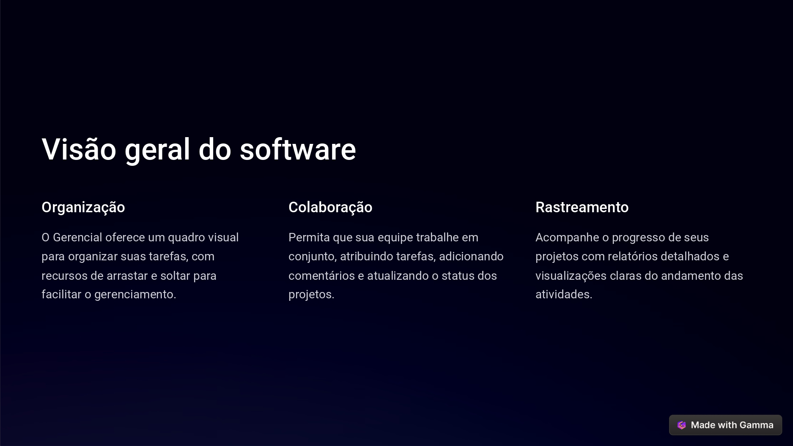

# gerencial-main

O Gerencial é uma ferramenta que proporciona um quadro visual para a organização de tarefas, utilizando recursos de arrastar e soltar. Ele facilita a colaboração ao permitir que a equipe atribua tarefas, adicione comentários e atualize o status dos projetos. Além disso, oferece funcionalidades para rastreamento do progresso dos projetos por meio de relatórios detalhados e visualizações claras das atividades em andamento.
